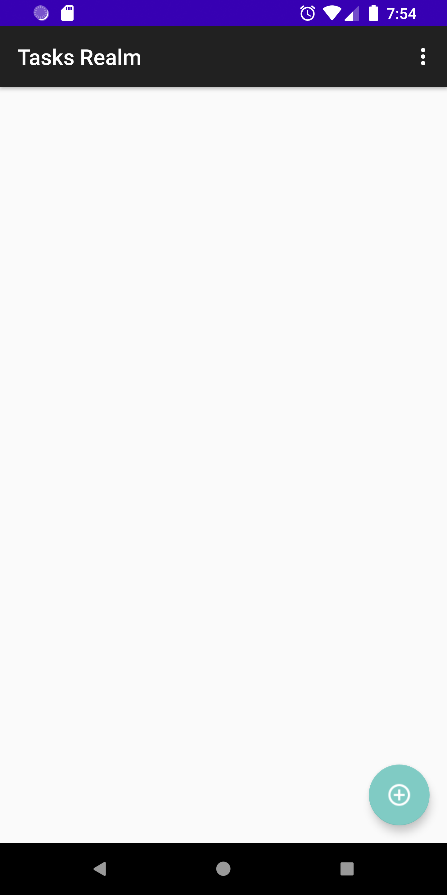
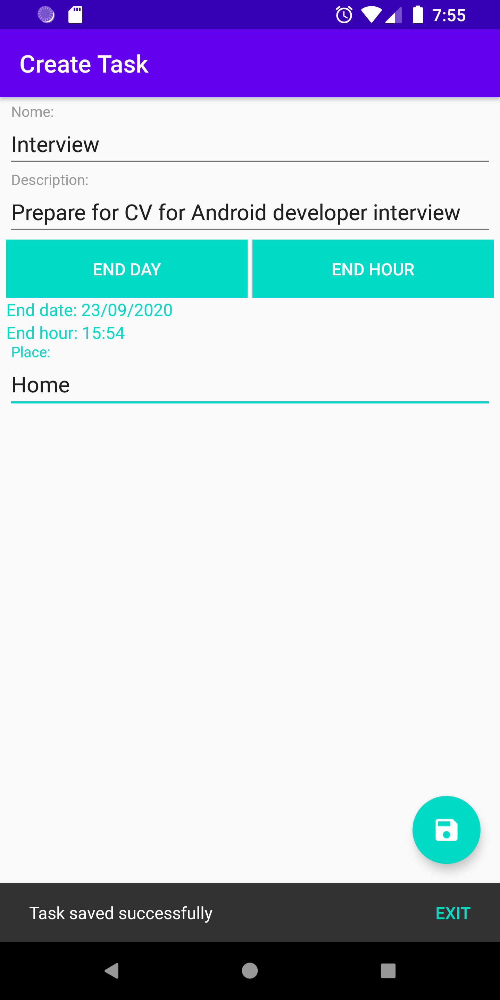
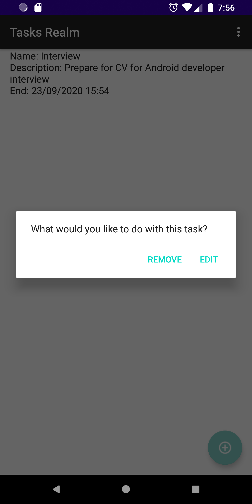
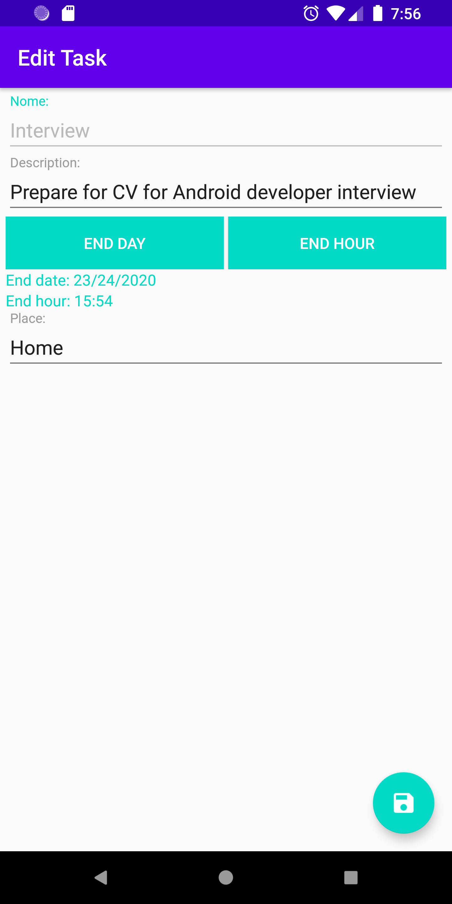

CRUD mobile application that uses the Realm orm framework to save and manage tasks. This is in alternative to the SQLite library that comes with the Android SDK.

All the data persistence is done by the class Realm. In this case it is being used a default configuration in the CoreApplication.java file.

The Task class extends RealmObject so that it can be persisted using the API. In this case it is used the Task name as the primary key.

